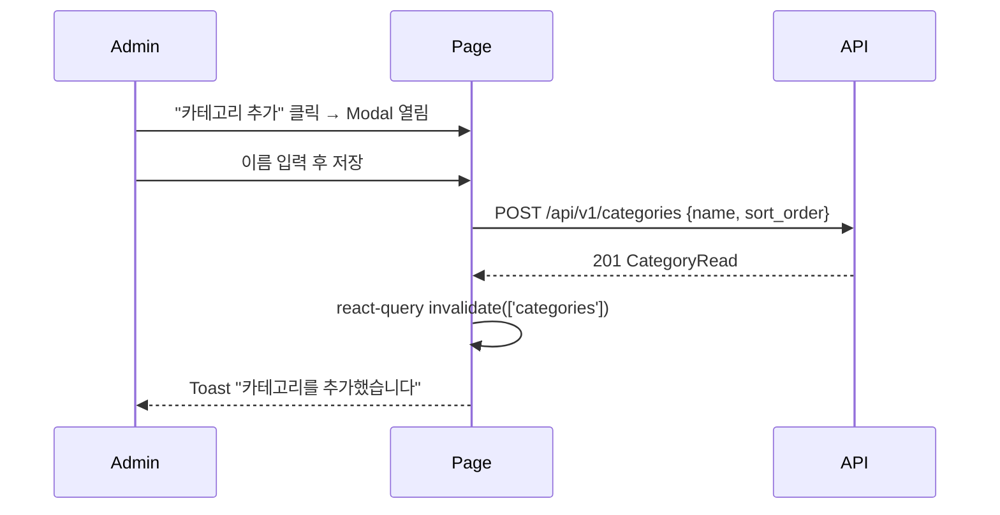
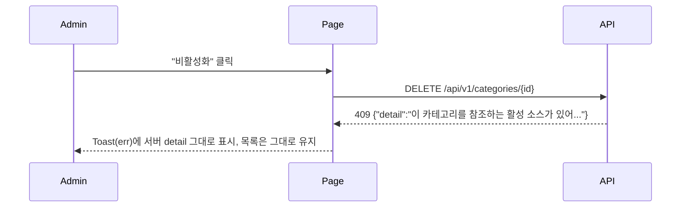

# 기술스펙_카테고리관리

- 기능요청: [#19](https://github.com/MEV-SW/mint-web/issues/19) / 인터페이스 정의: [화면정의서_카테고리관리](화면정의서_카테고리관리.md)([머지된 PR #21](https://github.com/MEV-SW/mint-web/pull/21))
- 작성: 채윤성 / 승인: 리뷰 없음(§3 — 단독 리포, 승인 상대 없음)

## 변경 범위
- `src/types/personalization.ts`: `NewsCategory`에 `is_active: boolean` 추가(서버 P1이 이미 응답에 포함).
- `src/api/personalizationApi.ts`: `createCategory`(POST `/categories`), `updateCategory`(PATCH `/categories/{id}`), `deleteCategory`(DELETE `/categories/{id}`) 추가 — 기존 `listCategories`와 같은 파일·스타일.
- `src/api/sourceApi.ts`: 변경 없음(기존 `listSources`를 카테고리 관리 화면에서 그대로 재사용해 소스 수를 집계).
- `src/components/layout/navItems.ts`: `APP_NAV_ADMIN_SUB`에 `{ path: '/admin/categories', label: '카테고리', icon: 'tag', superAdminOnly: true }` 추가.
- `src/App.tsx`: `SuperAdminRoute` 하위에 `<Route path="categories" element={<AdminCategoriesPage />} />` 추가(기존 `accounts`/`inquiries`/`webhooks`와 같은 위치).
- 신규 파일 `src/pages/AdminCategoriesPage.tsx` — 폼이 이름·정렬순서 2필드뿐이라 별도 `*FormFields` 컴포넌트로 안 뽑고 페이지 안에 인라인으로 둔다(과설계 방지).
- 백엔드·DB: 이 카드에서 변경 없음.

## DB 스키마 변경분
없음 — 프론트엔드 전용 카드.

## 핵심 흐름 (시퀀스 1-2개)

정상 경로 — 카테고리 추가:

실패 경로 — 사용 중인 카테고리 비활성화 시도:

## 외부 의존성
- 서버 [API스펙_카테고리소스스키마](https://github.com/MEV-SW/mint-server/blob/main/docs/기능/13-카테고리소스스키마/API스펙_카테고리소스스키마.md)(머지·배포됨)에 의존. 새 외부 라이브러리 없음 — 기존 `@tanstack/react-query`, `axios`(`apiClient`)만 사용.

## flag
없음. 관리자 라우트 게이팅(`SuperAdminRoute`)만으로 충분하고, 백엔드도 이 카드에 flag를 두지 않았다.
