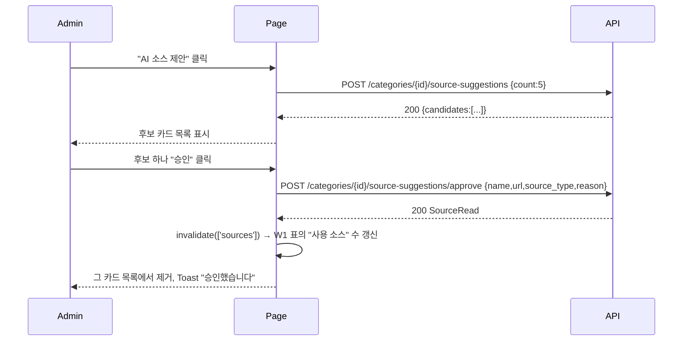
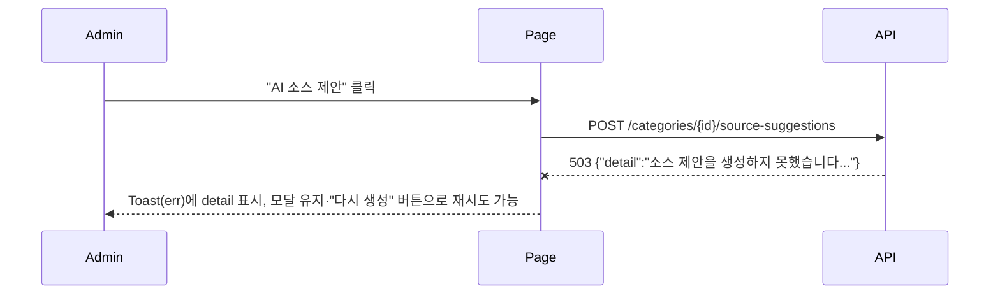

# 기술스펙_AI소스검토

- 기능요청: [#20](https://github.com/MEV-SW/mint-web/issues/20) / 인터페이스 정의: [화면정의서_AI소스검토](화면정의서_AI소스검토.md)([머지된 PR #24](https://github.com/MEV-SW/mint-web/pull/24))
- 작성: 채윤성 / 승인: 리뷰 없음(§3 — 단독 리포, 승인 상대 없음)

## 변경 범위
- `src/api/sourceApi.ts`: `suggestCategorySources(categoryId, count)`(POST `/categories/{id}/source-suggestions`), `approveCategorySourceSuggestion(categoryId, candidate)`(POST `/categories/{id}/source-suggestions/approve`) 추가.
- `src/types/source.ts`: `SourceSuggestionCandidate`(name/url/source_type/reason), `SourceSuggestResponse` 타입 추가(서버 P2 응답 형태 그대로).
- `src/pages/AdminCategoriesPage.tsx`: 각 행에 "AI 소스 제안" 버튼과 두 번째 Modal(`suggestFor: NewsCategory | null` 상태) 추가. 별도 파일로 안 뽑는다 — W1과 마찬가지로 화면 하나짜리 확장이라 과설계 방지.
- 백엔드·DB: 이 카드에서 변경 없음(서버 P2·P3 이미 완료).

## DB 스키마 변경분
없음.

## 핵심 흐름 (시퀀스 1-2개)

정상 경로 — 제안 조회 후 승인:

실패 경로 — 제안 생성 실패(LLM 오류):

## 외부 의존성
서버 [API스펙_AI소스제안](https://github.com/MEV-SW/mint-server/blob/main/docs/기능/14-ai소스제안/API스펙_AI소스제안.md)·[API스펙_소스승인](https://github.com/MEV-SW/mint-server/blob/main/docs/기능/15-소스승인/API스펙_소스승인.md)(둘 다 머지·배포됨)에 의존. 새 외부 라이브러리 없음.

## flag
없음.
