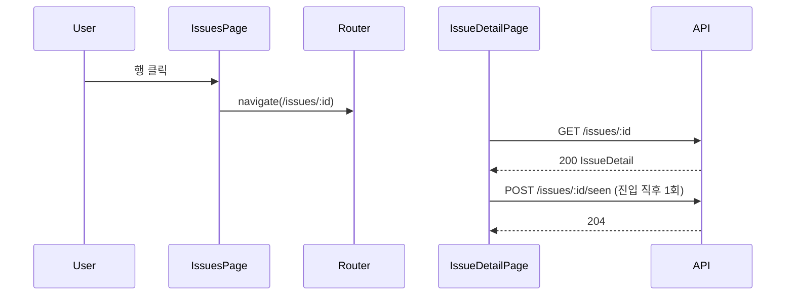
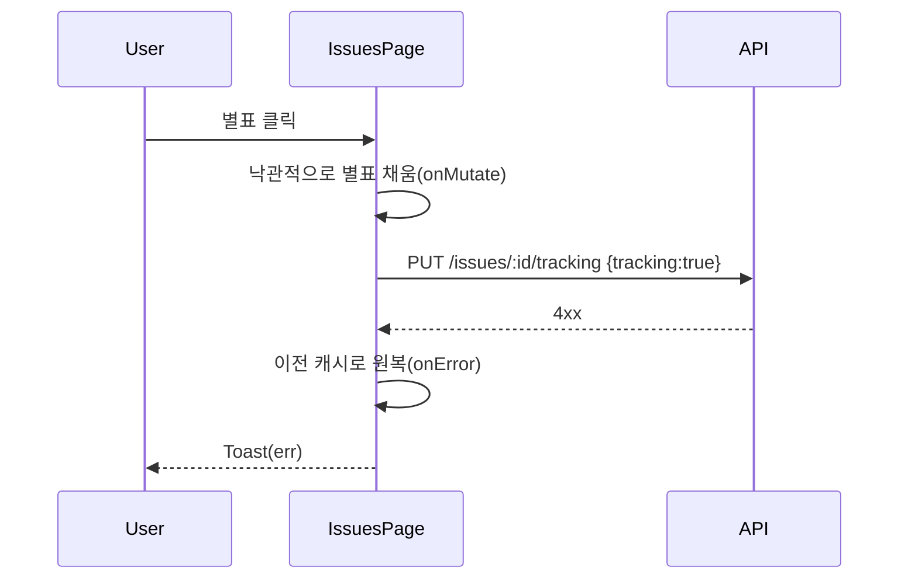

# 기술스펙_이슈목록상세

- 기능요청: [W2](https://github.com/MEV-SW/mint-web/issues/29) / 인터페이스 정의: [W1 화면정의서](https://github.com/MEV-SW/mint-web/blob/main/docs/기능/28-이슈레이더화면/화면정의서_이슈레이더화면.md)(화면 1·2) — W2 자체 인터페이스정의 문서는 새로 안 만든다, W1이 이미 두 화면을 확정했다.
- 작성: 채윤성 / 승인: 리뷰 없음(§3 — 단독 리포, 승인 상대 없음)

## 변경 범위

- `src/types/issue.ts` 신설: `IssueListItem`/`IssuePage`/`IssueMember`/`IssueDetail` — [B1 API스펙](https://github.com/MEV-SW/mint-server/blob/main/docs/기능/29-이슈데이터모델/API스펙_이슈데이터모델.md) 응답 그대로.
- `src/api/issueApi.ts` 신설: `listIssues`(`filter`/`page`/`size`), `getIssue`, `updateIssueTracking`, `markIssueSeen`.
- `src/pages/IssuesPage.tsx` 신설 — 화면 1(이슈 목록). 필터 칩 3종(전체/추적 중/이번 주 변화), 행 클릭 시 상세 이동, 별표로 추적 토글(낙관적 업데이트 + 실패 시 원복은 `onMutate`/`onError`로 react-query 표준 패턴).
- `src/pages/IssueDetailPage.tsx` 신설 — 화면 2(이슈 상세). 요약, 근거 기사 목록, 추적 토글, 진입 시 `POST /issues/{id}/seen` 1회 호출(실패해도 화면은 그대로 — best-effort). **변화 타임라인 영역은 자리만 두고 "준비 중" — 실제 구현은 [W3](https://github.com/MEV-SW/mint-web/issues/30)**.
- `src/App.tsx`: `/issues`, `/issues/:id` 라우트 추가(기존 `/news`와 같은 위치, `ProtectedRoute` > `OnboardingGate` 안).
- `src/components/layout/navItems.ts`: `APP_NAV_MAIN`에 `{ path: '/issues', label: '이슈', icon: 'inbox' }` 추가('뉴스'-'리포트' 사이).
- 백엔드: 이 카드에서 변경 없음(기존 B1 API 그대로 소비).

## DB 스키마 변경분

없음 — 프론트엔드 전용 카드.

## 핵심 흐름 (시퀀스 1-2개)

정상 경로 — 목록에서 상세 진입, 확인 커서 갱신:

실패 경로 — 추적 토글 실패 시 원복:

## 외부 의존성

- [B1](https://github.com/MEV-SW/mint-server/issues/29) 조회 API(머지·구현됨)에 의존. **B4(증분 사건 배정)가 아직 없어 `issues` 테이블은 항상 비어있다 — 이 화면은 지금 항상 "아직 묶인 사건이 없습니다" 빈 상태만 보인다.** 이건 버그가 아니라 카드 순서상 당연한 상태.
- 새 외부 라이브러리 없음.

## 알려진 갭

- 화면정의서는 "flag off면 내비 항목이 안 나타난다"고 정했지만, 프론트가 백엔드 `ISSUE_RADAR_ENABLED` 값을 읽을 방법이 지금 없다(기존 `personalization_enabled`도 프론트에 노출 안 됨 — 이 리포에 선례가 없다). 지금은 내비 항목을 무조건 보여주고, flag가 꺼져 있으면 API가 404 → 화면의 오류 상태(재시도 블록)로 대체한다. flag 노출이 필요해지면 별도 카드.

## flag

없음 — 백엔드 `ISSUE_RADAR_ENABLED`가 이미 게이트(위 "알려진 갭" 참고).
