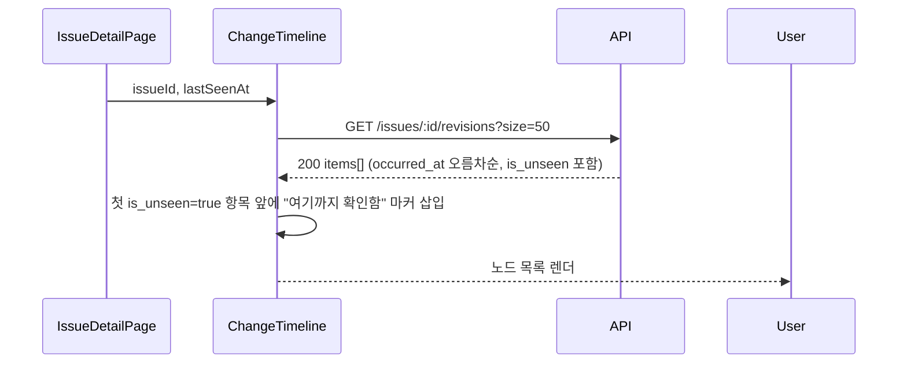

# 기술스펙_변화타임라인

- 기능요청: [W3](https://github.com/MEV-SW/mint-web/issues/30) / 인터페이스 정의: [W1 화면정의서](https://github.com/MEV-SW/mint-web/blob/main/docs/기능/28-이슈레이더화면/화면정의서_이슈레이더화면.md)(화면 3)
- 작성: 채윤성 / 승인: 리뷰 없음(§3 — 단독 리포, 승인 상대 없음)

## 변경 범위

- `src/components/common/Badges.tsx`: `ChangeKindBadge`(kind 5종 라벨)·`FactTypeBadge`(사실/AI해석/추가확인, 기존 `.badge-mint`/`.badge-info`/`.badge-med` 재사용)·`NewBadge`(기존 `.badge-failed` 재사용) 추가 — 배지 3종 요구사항을 재사용 컴포넌트로.
- `src/components/issues/ChangeTimeline.tsx` 신설 — 재사용 컴포넌트. `issueId`·`lastSeenAt` props. 로딩(노드 3개 스켈레톤)/오류(재시도)/정상 3상태.
- `src/pages/IssueDetailPage.tsx`: "준비 중" placeholder를 `<ChangeTimeline issueId={issue.id} lastSeenAt={issue.last_seen_at} />`로 교체. `issue.last_seen_at`은 진입 시점 `POST /seen` 호출 **전** 값(쿼리가 새로고침 안 되므로 W1이 요구한 "이번 진입 직전" 기준을 그대로 만족).
- 백엔드: `IssueRevisionRead`에 `original_url` 추가(별도 작은 PR, [Refs #30](https://github.com/MEV-SW/mint-server/pull/44)) — 원문 새 탭 액션에 필요한데 B1에 빠져 있었음.

## DB 스키마 변경분

없음.

## 핵심 흐름 (시퀀스 1-2개)

정상 경로:

## 외부 의존성

[B1](https://github.com/MEV-SW/mint-server/issues/29)(구현됨) + [PR #44](https://github.com/MEV-SW/mint-server/pull/44)(`original_url`)에 의존.

## 알려진 갭

- `duplicate_post_ids`는 서버가 ID 배열만 주고 제목·출처를 리졸브하지 않는다(B1이 그렇게 만들었음). "펼치면 개별 기사"는 이 카드에서 구현 안 함 — "중복 보도 N건" 접힌 요약만 표시. 펼치기가 필요해지면 배치 조회 엔드포인트가 있는 별도 카드가 필요.
- 페이지네이션("이전 변화 더 보기")은 안 만듦 — `size=50`으로 한 번에 가져온다. 50건 넘는 이슈가 실제로 생기면(B4/B5 이후) 추가.

## flag

없음.
