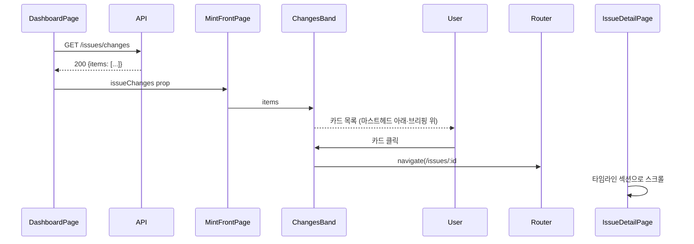
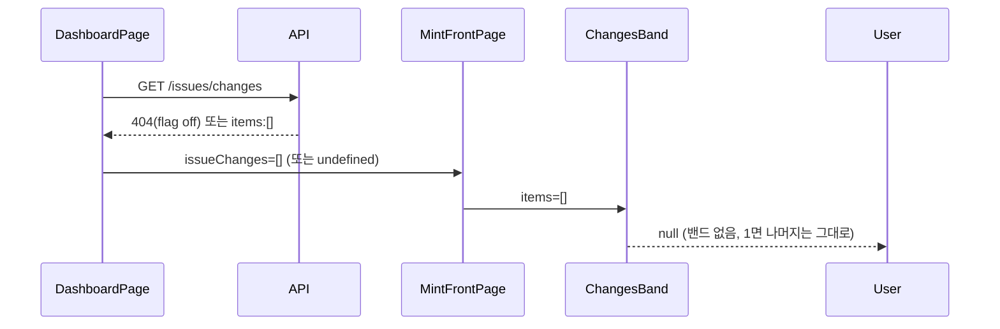

# 기술스펙_1면변화밴드

- 기능요청: [W5](https://github.com/MEV-SW/mint-web/issues/32) / 인터페이스 정의: [W1 화면정의서](https://github.com/MEV-SW/mint-web/blob/main/docs/기능/28-이슈레이더화면/화면정의서_이슈레이더화면.md)(화면 4)
- 작성: 채윤성 / 승인: 리뷰 없음(§3 — 단독 리포, 승인 상대 없음)

## 변경 범위

- `src/types/issue.ts`: `IssueChangeItem`/`IssueChangesResponse` 추가.
- `src/api/issueApi.ts`: `listIssueChanges(limit)` — `GET /issues/changes` 소비.
- `src/components/dashboard/ChangesBand.tsx` 신설 — `items`가 비면 `null` 반환(밴드 자체를 안 그림). 카드 클릭 시 `/issues/:id#timeline`으로 이동.
- `src/components/dashboard/MintFrontPage.tsx`: `issueChanges` prop 추가, 기존 마스트헤드(`np-personal-strip`)·소스 없음 배너 **아래**, AI 데일리 브리핑(`np-brief-band`, 기존 "톱 스토리"에 해당) **위**에 `<ChangesBand items={issueChanges ?? []} />` 삽입.
- `src/pages/DashboardPage.tsx`: `useQuery(['issue-changes'], () => listIssueChanges())` 1회 조회 후 모든 지면(edition) 시트에 동일하게 전달 — 지면별로 각각 호출하지 않는다(조직 전체 데이터라 에디션 무관).
- `src/pages/IssueDetailPage.tsx`: `#timeline` 해시로 진입 시 타임라인 섹션으로 스크롤(`scrollIntoView`).

## DB 스키마 변경분

없음.

## 핵심 흐름 (시퀀스 1-2개)

정상 경로:

오류/빈 경로 — 조용히 숨김:

## 외부 의존성

[B1](https://github.com/MEV-SW/mint-server/issues/29) `GET /issues/changes`(구현됨)에 의존.

## flag

없음 — `ISSUE_RADAR_ENABLED` off면 API가 404 → 위 "조용히 숨김" 경로로 자연히 처리(완료 판정 "기능 OFF에서 1면 회귀 없음"을 별도 분기 없이 만족).
