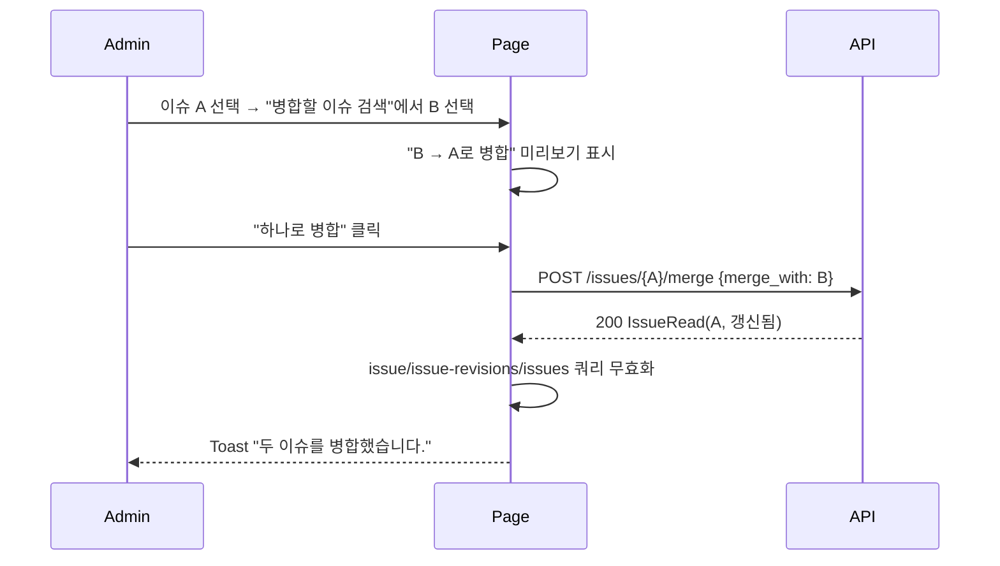
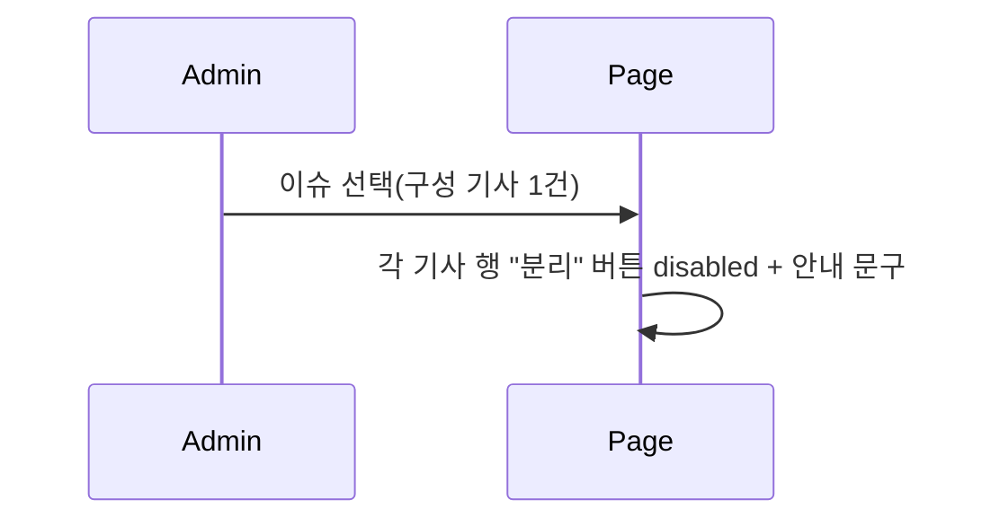

# 기술스펙_이슈병합분리화면

- 기능요청: [W6](https://github.com/MEV-SW/mint-web/issues/33) / 인터페이스 정의: [W1 화면정의서](https://github.com/MEV-SW/mint-web/blob/main/docs/기능/28-이슈레이더화면/화면정의서_이슈레이더화면.md)(화면 5) — W6 자체 인터페이스정의 문서는 새로 안 만든다.
- 작성: 채윤성 / 승인: 리뷰 없음(§3 — 단독 리포, 승인 상대 없음)

## 변경 범위

- `src/types/issue.ts`: `IssueRevision`/`IssueRevisionPage` 추가.
- `src/api/issueApi.ts`: `listIssues`에 `q`(제목 검색) 파라미터, `listIssueRevisions`/`mergeIssue`/`splitIssue` 추가 — [B6](https://github.com/MEV-SW/mint-server/issues/33) API 소비.
- `src/pages/AdminIssuesPage.tsx` 신설 — 화면 5(관리자 병합·분리). 이슈 검색·선택(재사용 `IssueSearchBox` 서브컴포넌트, 병합 대상 검색에도 재사용) → 좌측 구성 기사 목록(+분리 버튼) → 우측 작업 미리보기(분리/병합 확인) → 하단 수정 이력.
- `src/App.tsx`: `/admin/issues`를 기존 `SuperAdminRoute` 하위에 추가(`/admin/accounts`와 동일 게이팅).
- `src/components/layout/navItems.ts`: `APP_NAV_ADMIN_SUB`에 "이슈 정리" 추가(`adminOnly`+`superAdminOnly`, 기존 "문의"와 동일 패턴).
- 백엔드: `GET /issues`에 `q` 파라미터 추가(별도 작은 PR, [Refs #29](https://github.com/MEV-SW/mint-server/pull/43)) — B6 API스펙이 이미 이 화면의 검색을 여기 맡겨뒀는데 B6 구현 때 빠졌던 것.

## DB 스키마 변경분

없음 — 프론트엔드 전용 카드(백엔드 쪽 `q` 파라미터는 별도 작은 카드로 처리).

## 핵심 흐름 (시퀀스 1-2개)

병합 확정:

분리 — 구성 기사 2건 미만이라 버튼 비활성:

## 외부 의존성

[B6](https://github.com/MEV-SW/mint-server/issues/33)(머지·구현됨)에 의존. 새 외부 라이브러리 없음.

## flag

없음 — 라우트가 이미 `SuperAdminRoute`로 게이팅되고, 백엔드도 `ISSUE_RADAR_ENABLED`가 게이트.
