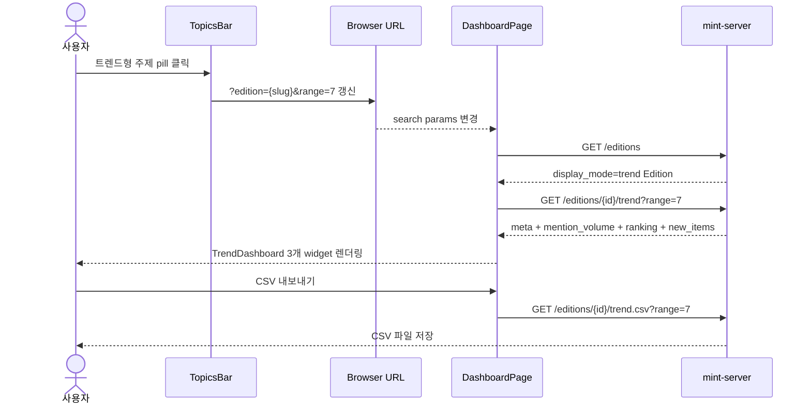
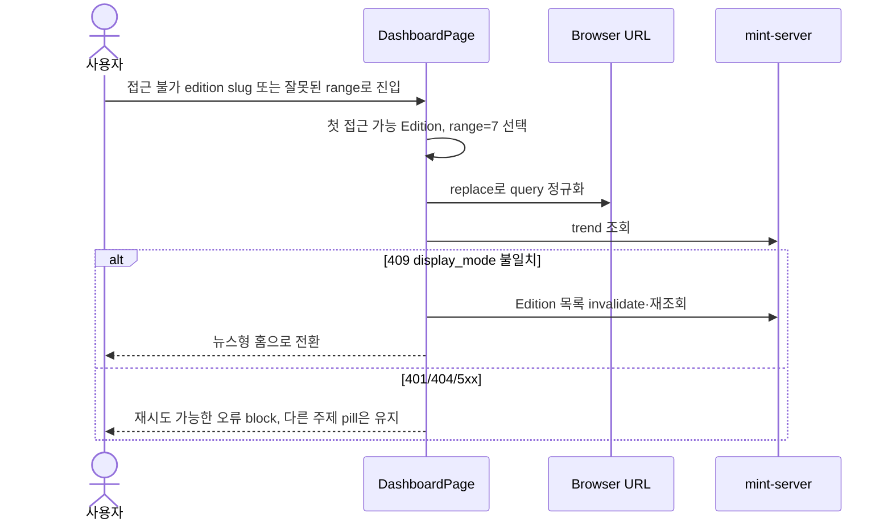

# 기술스펙_MOTREXEV주제화면

- 기능요청: [#57](https://github.com/MEV-SW/mint-web/issues/57) / 인터페이스 정의: [화면정의서_MOTREXEV주제화면](화면정의서_MOTREXEV주제화면.md)([머지된 PR #58](https://github.com/MEV-SW/mint-web/pull/58))
- 작성: yschae0311 / 승인: 리뷰 없음(기술스펙은 본인이 올리고 머지)

## 변경 범위

- `src/types/edition.ts`: `EditionDisplayMode`, Edition/Create/Update의 `display_mode`를 추가한다.
- `src/types/source.ts`: `edition_ids?: string[]`를 제거하고 `edition_id: string` 단일 필드로 바꾼다. SourceCreate도 필수 단일 주제를 받는다.
- `src/types/trend.ts`(신규): trend 메타, daily, category, ranking, new item 타입을 서버 API 스펙과 같은 이름으로 정의한다.
- `src/api/editionApi.ts`: trend JSON 조회와 CSV blob 다운로드 함수를 추가한다.
- `src/api/sourceApi.ts`, `src/pages/SourcesPage.tsx`, `src/components/sources/SourceFormFields.tsx`: 체크박스 다중 배정을 단일 select로 바꾸고 생성·수정 payload를 정렬한다.
- `src/components/layout/TopicsBar.tsx`(신규), `src/components/layout/AppLayout.tsx`: TopNav 아래에 주제 pill을 렌더링한다. URL `edition` slug를 단일 source of truth로 쓰며 키오스크에서는 숨긴다.
- `src/pages/DashboardPage.tsx`: Edition 목록이 확정될 때까지 skeleton을 보이고, 선택 Edition의 `display_mode`로 기존 `MintFrontPage` 또는 `TrendDashboard`를 분기한다.
- `src/components/trend/TrendDashboard.tsx`, `MentionVolumeWidget.tsx`, `TrendRankingWidget.tsx`, `NewInformationWidget.tsx`, `TrendMeta.tsx`(신규): 3개 위젯과 메타·기간 toggle·CSV 액션을 구현한다. 막대그래프는 외부 차트 라이브러리 없이 CSS grid/bar와 접근 가능한 표 대체 텍스트로 만든다.
- `src/pages/SettingsPage.tsx`: 신규/기존 Edition의 표시 방식 radio와 TOPIC_TERMS chip 편집, 검색 가능한 소스 배정, 마이그레이션 확인, SNS 비활성 안내를 추가한다. 소스 이동은 확인 modal 뒤 단일 `edition_id` PATCH로 실행한다.
- `src/styles/mint.css`, 필요 시 `src/styles/editorial.css`: 기존 토큰을 재사용하고 `--trend-amber-dark: #7a4e12` 하나만 추가한다. TOPICS bar, 위젯, 관리 UI의 간격·배지·button·responsive 스타일을 화면정의 값으로 추가한다.
- `src/App.tsx`, `index.html`과 작업지시서에 열거된 사용자 노출 컴포넌트: 브랜드 문자열을 `MOTREXEV` 또는 `MOTREXEV Intelligence News & Trend`로 바꾼다. 파일명·CSS class·컴포넌트명은 유지한다.
- `src/utils/editionSelection.ts`(신규): 접근 가능한 Edition 목록과 query parameter에서 선택 주제를 결정하고 잘못된 slug·range를 기본값으로 정규화한다.
- `src/**/*.test.ts(x)`: URL 유지, display mode 분기, 3개 빈 상태, 증감·NEW 표현, CSV 호출, admin 권한, chip 중복 방지, 단일 소스 이동, 브랜드 문자열 회귀를 검증한다.
- 백엔드와 DB는 이 카드에서 변경하지 않는다. 기존 `/topics/:keywordId`와 검수함 제거 상태도 변경하지 않는다.

## DB 스키마 변경분

없음 — 프론트엔드 전용 카드다.

## 핵심 흐름 (시퀀스 1-2개)

정상 경로 — 주제 선택과 트렌드 렌더링:

실패 경로 — 잘못된 URL 또는 API 불일치:

## 외부 의존성

- mint-server [API스펙_MOTREXEV주제트렌드](https://github.com/MEV-SW/mint-server/blob/main/docs/%EA%B8%B0%EB%8A%A5/78-motrexev%EC%A3%BC%EC%A0%9C%ED%8A%B8%EB%A0%8C%EB%93%9C/API%EC%8A%A4%ED%8E%99_MOTREXEV%EC%A3%BC%EC%A0%9C%ED%8A%B8%EB%A0%8C%EB%93%9C.md)의 `display_mode`, 단일 `edition_id`, trend JSON·CSV 계약에 의존한다.
- 기존 `react-router-dom`, `@tanstack/react-query`, Axios `apiClient`, `lucide-react`만 사용한다. 차트 패키지는 추가하지 않는다.
- 시각 기준은 `sample_design/MOTREXEV Intelligence -offline-.html`과 기존 `mint.css` 토큰이다.

## flag

신규 flag 없음. 서버의 Edition `display_mode`를 기능 분기로 사용한다. 값이 없을 가능성은 백엔드 동시 배포 전 호환 구간에만 있으며 프론트 타입·런타임 fallback은 이를 `news`로 처리한다.
