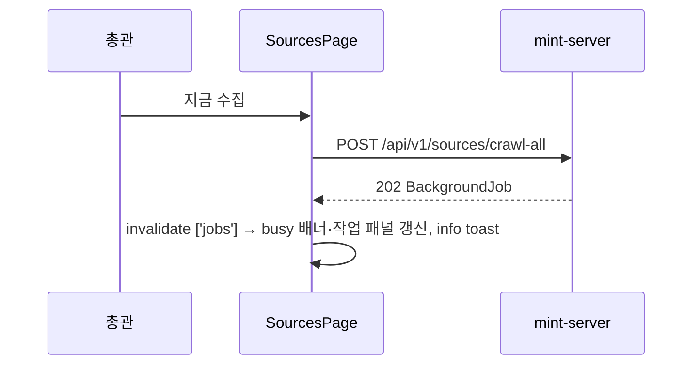
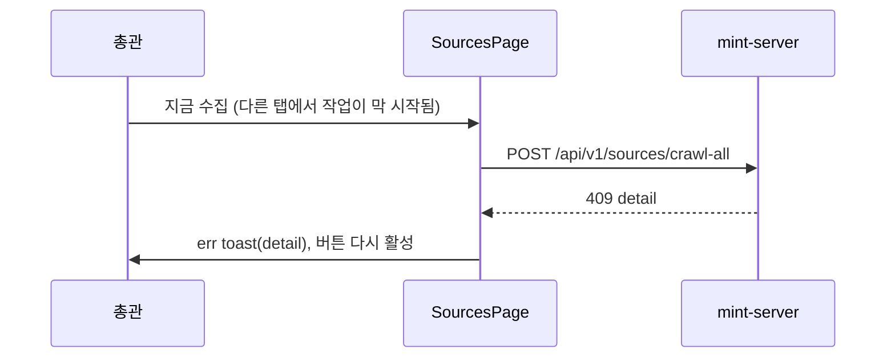

# 기술스펙_수동전체수집

- 기능요청: [mint-web#68](https://github.com/MEV-SW/mint-web/issues/68) / 인터페이스 정의: [화면정의서_수동전체수집](화면정의서_수동전체수집.md)
- 작성: yschae0311 / 승인: 리뷰 없음(DEV-PROCESS §2)

## 변경 범위
- `src/api/sourceApi.ts`: `crawlAllSources()` 추가 — `POST /api/v1/sources/crawl-all`, response는 기존 `BackgroundJob` 타입.
- `src/pages/SourcesPage.tsx`: 운영 카드 1장 추가.
  기존 `runDailyDiscoveryPipeline`과 같은 패턴(로컬 running 상태 → API → `['jobs']` 무효화 → toast)을 따른다.
  권한은 `usePermissions().isAdmin`, 진행 중 여부는 기존 `useActiveJobs().busy`를 쓴다.
- `src/styles/mint.css`: `.sources-ops-grid`를 2열로, 새 아이콘 배경 `.sources-op-card-icon-crawl` 추가. 760px 이하 1열 규칙은 그대로.
- `src/components/trend/TrendDashboard.tsx`: 메타 줄 문구만 변경. 데이터 요청·레이아웃 변경 없음.
- 작업 패널·busy 배너·작업 목록 API 호출은 변경 없음.

## DB 스키마 변경분
- 없음 (프론트엔드).

## 핵심 흐름 (시퀀스 1-2개)

## 외부 의존성
- mint-server [#138](https://github.com/MEV-SW/mint-server/issues/138)의 `POST /api/v1/sources/crawl-all`.
  서버가 먼저 배포되지 않으면 버튼이 404 err toast를 낸다. 같은 릴리즈에서 서버와 함께 배포한다.

## flag
- 없음.
