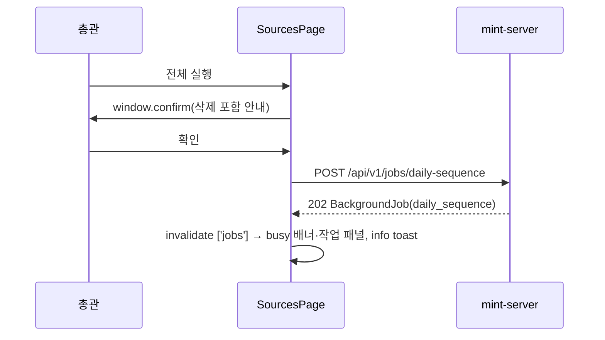
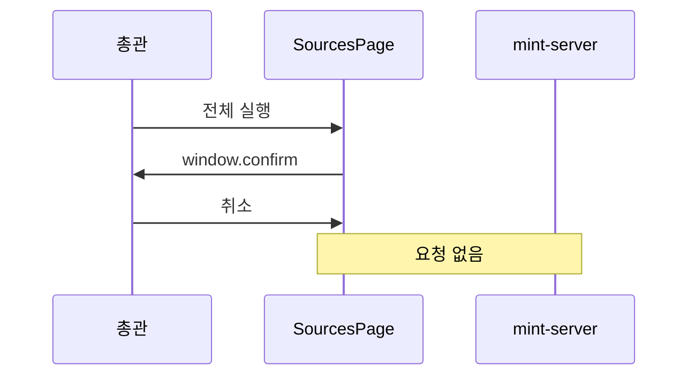

# 기술스펙_일일시퀀스수동실행

- 기능요청: [mint-web#72](https://github.com/MEV-SW/mint-web/issues/72) / 인터페이스 정의: [화면정의서_일일시퀀스수동실행](화면정의서_일일시퀀스수동실행.md)
- 작성: yschae0311 / 승인: 리뷰 없음(DEV-PROCESS §2)

## 변경 범위
- `src/api/jobApi.ts`: `runDailySequence()` 추가 — `POST /api/v1/jobs/daily-sequence`, response는 기존 `BackgroundJob`.
- `src/types/job.ts`: `JobType`에 `'daily_sequence'` 추가. 작업 패널은 `label`을 그대로 보여주므로 표시 코드는 바꾸지 않는다.
- `src/pages/SourcesPage.tsx`: 첫 운영 카드의 제목·설명을 바꾸고 `전체 실행` 버튼을 추가한다.
  `runCrawlAllSources`와 같은 패턴(로컬 running 상태 → API → `['jobs']` 무효화 → toast)이고, 앞에 `window.confirm`을 둔다.
  두 버튼은 `isAdmin`, `busy`, 두 로컬 running 상태를 함께 보고 비활성화한다.
- `src/styles/mint.css`: 변경 없음. 기존 `sources-op-card-controls`가 버튼 여러 개를 가로로 배치한다.
- 다른 화면·작업 패널은 변경 없음.

## DB 스키마 변경분
- 없음 (프론트엔드).

## 핵심 흐름 (시퀀스 1-2개)

## 외부 의존성
- mint-server [#142](https://github.com/MEV-SW/mint-server/issues/142)의 `POST /api/v1/jobs/daily-sequence`. 서버가 먼저 배포되지 않으면 404 err toast. 같은 릴리즈에서 함께 배포한다.

## flag
- 없음.
