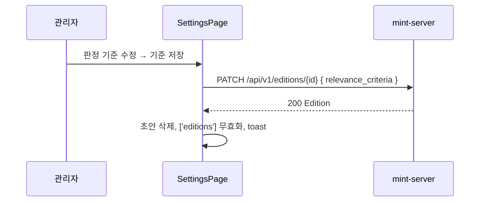
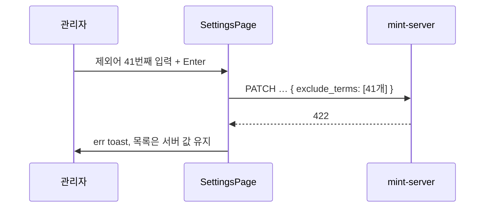

# 기술스펙_주제판정기준편집

- 기능요청: [mint-web#76](https://github.com/MEV-SW/mint-web/issues/76) / 인터페이스 정의: [화면정의서_주제판정기준편집](화면정의서_주제판정기준편집.md)
- 작성: yschae0311 / 승인: 리뷰 없음(DEV-PROCESS §2)

## 변경 범위
- `src/types/edition.ts`: `Edition`에 `exclude_terms: string[]`, `relevance_criteria: string | null`. `EditionCreate`·`EditionUpdate`에 같은 선택 필드.
- `src/pages/SettingsPage.tsx`
  - `saveEditionMeta` 인자에 `exclude_terms`, `relevance_criteria` 추가(보내지 않은 필드는 PATCH에 포함하지 않음 — 지금처럼 `undefined`는 직렬화에서 빠진다).
  - 판정 기준 입력은 주제별 초안 상태 `criteriaDraftByEdition`(기존 `newTopicTermByEdition`과 같은 패턴). 초안이 없으면 저장값을 보여주고, 저장 성공 시 그 주제 초안을 지운다.
  - 제외어 칩 입력은 관련성 키워드 칩 입력 코드를 그대로 따른다. 입력 상태 `newExcludeTermByEdition`.
  - 주제 추가 패널에 `newEditionCriteria` 상태와 textarea, `addEdition`에 `relevance_criteria` 전달.
  - 관련성 키워드 설명 문구 조정.
- `src/styles/mint.css`: `topic-criteria-editor`(textarea 높이·저장 버튼 정렬) 소규모 추가. 기존 토큰만 사용.
- 편집장 전용 구 레이아웃(`edition-admin-grid`, 담당 주제가 없는 편집장에게만 보임)은 변경하지 않는다.

## DB 스키마 변경분
- 없음 (프론트엔드).

## 핵심 흐름 (시퀀스 1-2개)

## 외부 의존성
- mint-server [#147](https://github.com/MEV-SW/mint-server/issues/147)의 주제 API 필드. 서버가 먼저 배포되지 않으면 두 필드가 응답에 없어 빈 값으로 보이고 저장은 무시된다. 같은 릴리즈에서 함께 배포한다.

## flag
- 없음.
